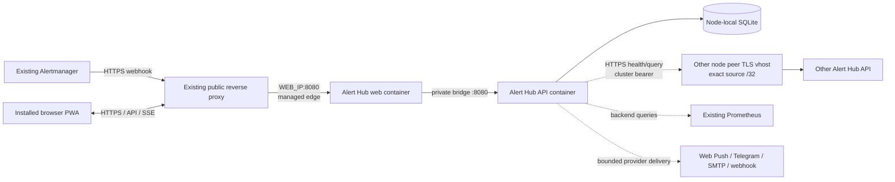
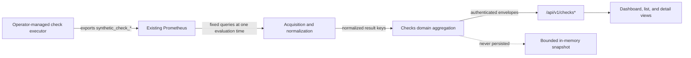
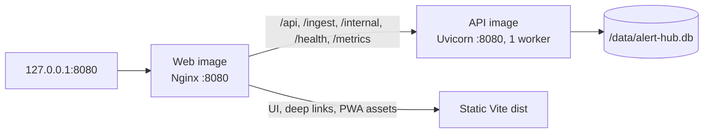

# Architecture

## System boundary

Alert Hub runs beside existing monitoring rather than replacing it. Alertmanager and other sources
send webhooks; Prometheus remains the time-series authority; Grafana remains the detailed
visualization surface. A replicated, validated Grafana URL supplies an authenticated UI link but no
credential or query surface. Administrators can select bounded `job` globs for named `up` queries;
the server constructs PromQL and never accepts browser-authored PromQL. Each Alert Hub node owns a
local SQLite database and is intended to remain useful when peers are unreachable.



Checks uses that existing Prometheus boundary as a read-only, optional read model. Alert Hub does
not schedule or execute checks, manage an executor, ingest check results over HTTP, or introduce a
prober service. The module issues only fixed server-owned instant-vector queries for the
`synthetic_check_*` metric contract. Prometheus metric names and labels stop at the dedicated
acquisition/normalization boundary; the domain layer receives protocol-neutral Check, Source,
Target, Scenario, Variant, Canary, and Assertion values, and the API returns an explicit allowlist
of normalized fields.



A result key is `(check_id, source, scenario, variant)`; absent optional dimensions use private,
stable sentinels that are not presented as invented user data. `synthetic_check_info` supplies the
expected inventory when available. Without it, only series currently visible in the required
status/timestamp metrics can establish inventory, and process restart loses any cache-only memory
of disappeared series. Samples, run history, current status, and snapshots are never copied into
SQLite. Existing alert and incident history remains durable: a Check may read active relationships
by exact safe `check_id`, but a failed Check does not create an incident and alert state does not
override Check aggregation.

Every node evaluates its own configured Prometheus view and owns its own short-lived cache. Checks
failure or disablement cannot affect local ingest, incident actions, notification work, peer sync,
or readiness. A failed required Prometheus refresh becomes `data_state: unavailable`; a previous
success is never silently served as current. Optional metric failures remove only the associated
duration, TTFB, canary, or assertion capability and add a warning.

Only operator-managed reverse proxies terminate public HTTPS. Production host
proxies target fixed web/API addresses on the managed edge bridge; a
containerized Caddy uses service DNS on that bridge. Loopback publishes are
reserved for local smoke/operator checks. The ordinary UI proxy returns `404`
for `/internal/*`, `/metrics`, `/health/deep`,
`/api/docs*`, `/api/redoc*`, and `/api/openapi.json`. A separate peer hostname
accepts only the other nodes' exact public `/32` sources and routes only
`GET /internal/v1/nodes/health` and
`POST /internal/v1/sync/events/query`; every other method/path fails closed.
Prometheus scraping, deep diagnostics, and API documentation stay on
loopback/private operator paths rather than either public virtual host.
An operator may instead keep literal RFC1918/ULA HTTP peer origins inside an
authenticated WireGuard/private network; that optional transport is not
required by the standard HTTPS peer-hostname deployment.

## Independent image model

A release contains two independently deployable artifacts. Vite builds the SPA in the web image's
Node.js build stage; its production image serves immutable assets without a Node.js runtime. The
API image is built only from `backend/` and has no dependency on npm or frontend files:



Both runtimes are unprivileged and use read-only root filesystems. The API alone mounts persistent
`/data` and secret files. The web service gets only bounded tmpfs space for runtime branding and
Nginx state; it never receives the application env file, database, or secrets. It proxies through
a dedicated bridge address which is the only container proxy trusted by the API. If API readiness
is lost, Nginx stays alive and fails application/static requests closed with `503`; it recovers
without a web restart when the API returns. Uvicorn remains one worker because SQLite write
serialization and restart-safe in-process background loops are part of the MVP constraint.

The two images carry the same release version and OpenAPI-derived compatibility value, but have
separate immutable digests. Updating one Compose service does not recreate the other. API-only
mode publishes the backend directly on loopback and does not require the web image.

## Application layers

The backend follows four simple dependency layers:

1. `api` owns HTTP validation, authentication, status mapping, and request context.
2. `application` orchestrates auth, intake, incident actions, and projections.
3. `domain` owns normalized event and adapter contracts without FastAPI or SQLAlchemy imports.
4. `infrastructure` owns SQLAlchemy, SQLite, source adapters, peer transport, and channel providers.

Checks follows the same dependency direction: fixed PromQL and bounded Prometheus transport stay
in `infrastructure`; `application` orchestrates acquisition, allowlisted metric-label
normalization, caching, and alert association; freshness, source quorum, and scenario/variant
aggregation stay in `domain`; and `api` owns authentication, filters, pagination, serialization,
and safe error status mapping.

Interfaces are used at external boundaries, not created for every trivial operation. Display
name is runtime configuration (`APP_NAME`); protocol fields, table names, and package namespace
do not depend on it. The normalized value feeds browser metadata, the runtime manifest, visible
branding, Web Push/Telegram headings, and SMTP subjects/sender display names.

## Event and consistency model

The target cluster has no write quorum. Every node assigns an immutable `(origin_node_id, origin_seq)` to append-only cluster events. Peers exchange vector cursors and apply events idempotently. Incident history is never overwritten; current state is a deterministic projection, with `event_id` as the final tie-breaker.

The priority is:

```text
do not lose an alert > avoid a duplicate notification
```

Therefore an isolated node may accept writes, and a network partition may produce duplicate deliveries. Reconnection must converge by event key and incident fingerprint without discarding either history. Replication is not a backup: corruption, operator error, or destructive events can replicate.

The repository implements append-only cluster history, a periodic paginated peer pull worker,
persisted vector cursors, deterministic application projection, full-history bootstrap from an
empty cursor, tombstones, split-brain bootstrap detection, replicated heartbeat observations,
durable notification ownership, and replicated delivery receipts. A heartbeat request is a
cluster event; each node projects the newest observation timestamp and reconciles a missed or
restored incident even when the observation and firing event arrive in the opposite order.

Connected nodes may store the same logical incident event under different local row IDs. Delivery
ownership and deterministic delivery IDs therefore use the stable incident `event_key`. A receipt
includes `source_event_key`, allowing the receiving node to map success to its corresponding local
event before a reserve node becomes eligible. This reduces connected-cluster duplicates without
claiming exactly-once delivery during a true partition.

Compact snapshot bootstrap, authenticated operator conflict resolution, and real
multi-region/provider validation remain follow-on work; see
[implementation status](implementation-status.md).

## Persistence invariants

- One SQLite file per node; never place it on NFS or a shared volume.
- WAL mode, foreign keys, a bounded busy timeout, and short transactions.
- Online SQLite backup before a schema migration when a database already exists.
- Application rollback keeps the forward-migrated database; schema changes remain N-1 compatible.
- Emergency database restore is a separate confirmed operation and may lose newer events.
- Master encryption, signing, VAPID, and cluster secrets live outside the database, image, release directory, and Git repository.

## Roles and future specialization

Every API node enables intake, notification, and synchronization roles by default. `INGEST_ENABLED`,
`NOTIFY_ENABLED`, and `SYNC_ENABLED` retain the option to specialize later without changing the
image. `UI_ENABLED=false` is enforced for the standalone API artifact; UI delivery is owned by the
web image. Disabling a role must not silently broaden another network boundary.

## Health semantics

- `/health/live`: process can answer HTTP.
- `/health/ready`: local API and SQLite are serviceable. Deploy gating uses this endpoint.
- `/health/deep`: local database plus informational peer/channel state. A remote peer failure must not make a locally useful node unready. The supplied public proxy denies it.
- `/metrics`: Prometheus exposition on the same loopback application port; there is no separately published monitoring port, and the supplied public proxy denies it.

## Deployment model

The release workflow builds version-tagged API and web GHCR images, tests their exact compatible
pair, and records both digest-qualified references in `release-manifest.json`. It accepts either
an existing version tag or a manual run on `main`; both must match the single product version in
the root `VERSION` file. In the manual flow it creates the immutable tag in the same validated
workflow. A release is not complete unless both artifacts, both SBOMs, and both provenance
attestations succeed.

Each node records current and historical component manifests beneath `/opt/alert-hub`. The
root-owned deployment wrapper is the privileged interface used by a dedicated self-hosted runner.
The API always has a separate outbound bridge and joins an existing monitoring Docker network only
through an optional root-owned production override. Host proxies reach the fixed web/API addresses
on the managed edge bridge; a containerized Caddy may instead add that bridge to its existing
proxy-owned networks and use the service names. It must not join Alert Hub egress or monitoring.
The loopback-published ports remain local smoke/operator endpoints. Production accepts only a masqueraded,
non-internal user-defined local bridge and status enforces the exact expected network set. The
root-owned provisioner and runtime wrappers share one lock, so a rollback-safe script/Compose
refresh cannot overlap deployment work. The engine validates exact digest references and
compatibility labels, protects SQLite
before API migration, updates only the requested service, gates readiness, and restores that
component's prior digest if the candidate fails. The separate manual deploy and rollback workflows
select protected RU/NL/DE GitHub Environments; those names and runner labels are automation
topology, not application logic.
